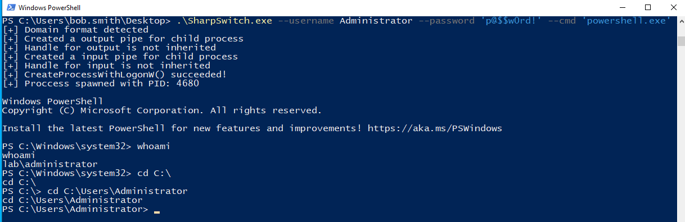

# SharpSwitch

Switch to another local user `without` spawning a new terminal/console window.

Supports:
- UPN Format

# Menu

```

   _____ _                      _____         _ _       _
  / ____| |                    / ____|       (_) |     | |
 | (___ | |__   __ _ _ __ _ __| (_____      ___| |_ ___| |__
  \___ \| '_ \ / _` | '__| '_ \\___ \ \ /\ / / | __/ __| '_ \
  ____) | | | | (_| | |  | |_) |___) \ V  V /| | || (__| | | |
 |_____/|_| |_|\__,_|_|  | .__/_____/ \_/\_/ |_|\__\___|_| |_|
                         | |
                         |_|

                    Author: @pwnlog
                    Version: 0.0.1


Usage:
    SharpSwitch --domain <domain name> --username <username> --password <password> --cmd <command>


Options:
    -d, --domain         Domain name (optional)
    -u, --username       Domain user name
    -p, --password       Domain user password
    -c, --cmd            Launch cmd.exe or powershell.exe
    -h, --help           Display help menu


Important:
    Only use single quotes (' ') when there are special characters
    If there aren't any special characters don't use single quotes (' '), instead use double quotes


Examples:
    SharpSwitch --domain <domain name> --username user01 --password 'p@$$w0rd' --cmd powershell.exe
    SharpSwitch --username test01 --password password --cmd cmd.exe
```

# Usage

Run a command as another user by proving valid credentials:

```powershell
.\SharpSwitch.exe --username Administrator --password 'p@$$w0rd!' --cmd 'powershell.exe'
```

Text output of the command above:

```powershell
PS C:\Users\bob.smith\Desktop> .\SharpSwitch.exe --username Administrator --password 'p@$$w0rd!' --cmd 'powershell.exe'
[+] Domain format detected
[+] Created a output pipe for child process
[+] Handle for output is not inherited
[+] Created a input pipe for child process
[+] Handle for input is not inherited
[+] CreateProcessWithLogonW() succeeded!
[+] Proccess spawned with PID: 4680

Windows PowerShell
Copyright (C) Microsoft Corporation. All rights reserved.

Install the latest PowerShell for new features and improvements! https://aka.ms/PSWindows

PS C:\Windows\system32> whoami
whoami
lab\administrator
PS C:\Windows\system32>
```

Image as proof:



Exit the process:

```powershell
exit
```